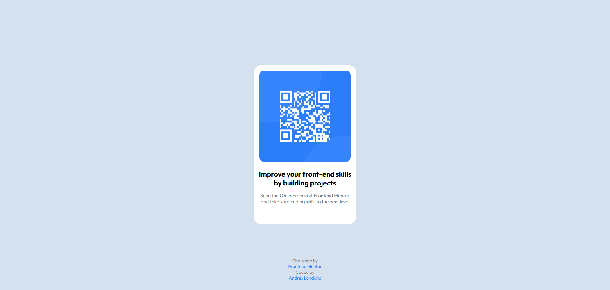

# Frontend Mentor - QR code component solution

This is a solution to the [QR code component challenge on Frontend Mentor](https://www.frontendmentor.io/challenges/qr-code-component-iux_sIO_H). Frontend Mentor challenges help you improve your coding skills by building realistic projects.

## Table of contents

- [Frontend Mentor - QR code component solution](#frontend-mentor---qr-code-component-solution)
  - [Table of contents](#table-of-contents)
    - [Screenshot](#screenshot)
    - [Links](#links)
  - [My process](#my-process)
    - [Built with](#built-with)
    - [What I learned](#what-i-learned)
    - [Continued development](#continued-development)
    - [Useful resources](#useful-resources)
  - [Author](#author)

### Screenshot



### Links

- Solution URL: [Github](https://github.com/andreslondono00/qr-code-component-main)

## My process

### Built with

- Semantic HTML5 markup
- CSS custom properties
- Flexbox

### What I learned

I learned how to use flexbox and how to size containers.

```css
.container {
  width: 320px;
  height: 499px;
  padding: 16px 8px;
  display: flex;
  flex-direction: column;
  align-items: center;
  box-sizing: border-box;
}
```

### Continued development

Use this section to outline areas that you want to continue focusing on in future projects. These could be concepts you're still not completely comfortable with or techniques you found useful that you want to refine and perfect.


### Useful resources

- [Example resource 1](https://developer.mozilla.org/en-US/docs/Web/CSS/flex) - He taught me all the uses of flex and his interactive examples
- [Example resource 2](https://flexboxfroggy.com/#es) - It's a fun game and at the same time you learn a lot.

## Author

- Frontend Mentor - [@andreslondono00](https://www.frontendmentor.io/profile/andreslondono00)
- Github - [@andreslondono00](https://github.com/andreslondono00)
